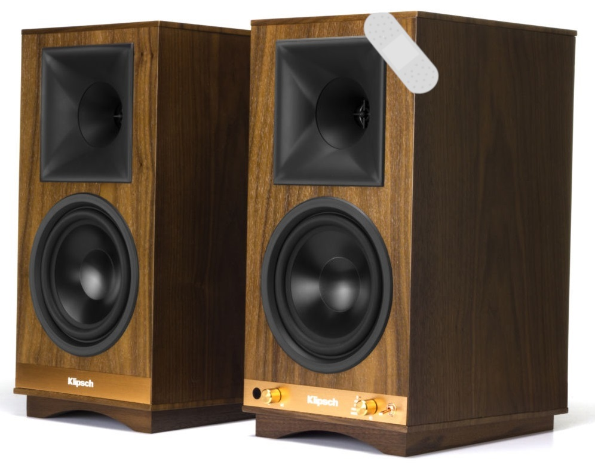

# Klipsch The Sixes - Firmware Issue Analysis

## Project Scope

This project documents reverse engineering and firmware-level stability fixes for Klipsch The Sixes based on a dumped MCU firmware image (no source code available).

## Device: HiFi - Active Speakers

### Great Active Speakers with Small Issues

This is an experimental project aimed at improving the stability of the device for long-term use. It involves analyzing the firmware to identify issues that arise over time.

---

The goal is to restore the device to full functionality, or at worst, ensure that it operates in a stable manner (without freezing or randomly turning off) for many years, without compromising sound quality.

---

## "Good Sound Deserves to Fill the Room, Not Rest in Silence in the Corner."

### Issues Identified:
- **Firmware stability problems** caused by a buffer overflow error.
- **Degradation of memory**, leading to loss of settings after a power loss (e.g., volume, selected input, etc.).
- **Bluetooth communication issues**. The Bluetooth module was analyzed, but the issue remains unresolved, with intermittent unstable connections.

These three main issues are interconnected, and it is unclear which is the root cause and which is the effect, as they influence each other.

### This Analysis Can Fix:
- **Fix Potential Bluetooth connection issues** - if the Bluetooth module is still operational.
- **Fix Input selection issues** - buffer overflow errors in the Bluetooth module disrupt device operation and prevent input selection from working properly.
- **Fix Speaker shutdown issue** - after 20 minutes of use, the speakers turn off and audio stops. This is **the main issue preventing the speakers from functioning properly**, likely caused by buffer overflow errors related to the Bluetooth module.

### This Analysis Will Not Fix:
- **Damaged Bluetooth module** - However, it can assist with deeper analysis of the issue and improve stability when operating without Bluetooth.
- **Damage to speakers or power transistors**.

---

# Repair Path

## Symptoms of Failure
- Front panel input selector becomes unresponsive (remote control still works)
- Random shutdowns; audio stops after 20–40 minutes
- Bluetooth LED blinking; unable to pair

## Technical Documentation Map

### Sections:
1. **Firmware analysis** → [01_firmware_analysis.md](docs/01_firmware_analysis.md)
2. **Patching** → [02_patching.md](docs/02_patching.md)
3. **Bluetooth hardware** → [03_bluetooth_hardware.md](docs/03_bluetooth_hardware.md)
4. **Appendix - PICkit 3 Connection Guide** → [pickit_connection.md](docs/pickit_connection.md)
