# Patching

## Step 3: Start Debugging

Use MPLAB IPE to read and copy the MCU firmware.

After reading the firmware in MPLAB IPE, save it as a HEX file. In some configurations, it may require enabling "Advanced mode" (password: "microchip").

In advanced mode, it is possible to unlock and enable saving the full HEX dump in normal mode.

---

***Important:***
Always save a full MCU firmware backup before starting debugging in MPLAB IDE. This ensures the ability to restore the original state if needed.

The debugger may modify certain registers or switch the MCU into debug mode. Restoring the original dump is required to return the device to production state.

---

## Flash MCU Dump Comparison

Compare MCU Flash dump before and after factory reset configuration:  
https://support.klipsch.com/hc/en-us/articles/360042457311-The-Sixes-Factory-Reset  

The dump is in Intel HEX format:  
https://en.wikipedia.org/wiki/Intel_HEX  

The Intel HEX format contains segments with address, data, and a checksum byte at the end of each line.  
For manual modification, a CRC/hex checksum calculator is required to fix the line checksum:  
https://www.fischl.de/hex_checksum_calculator/
#### Configuration Flash Compare


Line: ***:020000041D01DC***

changes the segment offset.

---

***Flash Config address 0x1D01E000*** was tested by writing and verifying different values (manually modified HEX files) using MPLAB IPE. Verification errors confirmed degradation of this Flash area.

---

***Note:***
In pseudocode, we can confirm configuration loading (names are matched using a manually defined [symbols.txt](symbols.txt)):

```c
void FUN_1d012f28_load_flash(int *param_1, uint param_2)
{
    FUN_1d012104_memcpy(param_1, (int *)&DAT_9d01e000, (param_2 & 0xff) + 1);
    return;
}
```
***DAT_9d01e000*** is the same Flash address ***0x1D01E000*** but mapped into cached memory.

https://developerhelp.microchip.com/xwiki/bin/view/products/mcu-mpu/32bit-mcu/PIC32/mx-arch-cpu-overview/memory-organization-overview/memory-map/  

The memory map defined in the documentation was used for analysis in Ghidra and stored in the file [mcu_memory_map.txt](mcu_memory_map.txt).

---

After a long analysis, it was determined that values such as ***0xFCB77550*** (little-endian in Flash dump: `0x50 0x75 0xB7 0xFC`) originate from messages coming from a malfunctioning Bluetooth module. These values were likely injected into the configuration due to a buffer overflow condition.

------
## Step 4: Root Cause Chain Analysis and Patching

For analysis and patching, the firmware update file in Intel HEX format can be used.

1. Use Ghidra for main analysis  
2. Use Radare2 + Cutter to apply test patches  
3. Debug using MPLAB IDE + PICkit 3 and analyze patch results  
4. Return to step 1 ↺

---

**These materials outline a working path for modifications.** You must have a solid understanding of what you're doing, especially when analyzing the code. The path presented here is only a general guideline, as it requires extensive analysis work. After applying each patch, it's crucial to **re-run the analysis** and **test the results**. The patching process often requires an **iterative approach**, where after each change, it's important to revisit earlier steps to ensure that the modifications haven't introduced new issues and that the fixes are effective.

---

Cutter uses an internal Ghidra-based analysis module. However, for renaming memory regions, defining symbols, and deeper analysis, Ghidra is more stable and provides a more readable view.

---

### Example: Applying a Patch in Radare2 + Cutter

Load file:  
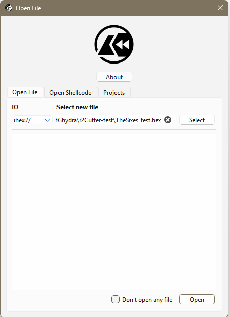

Configure project:  
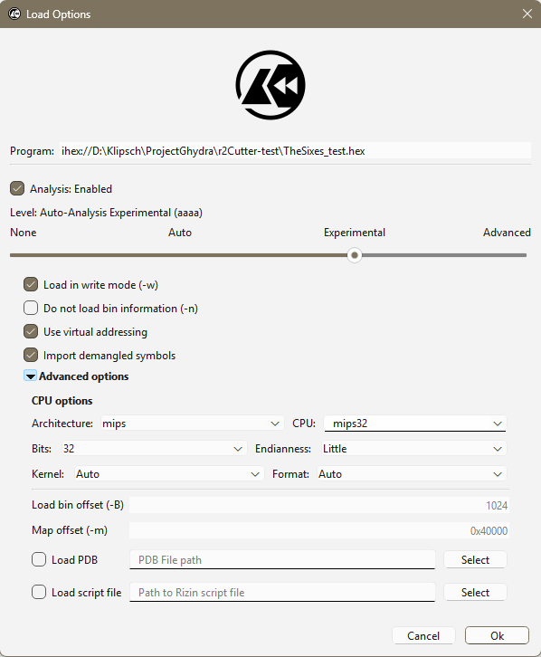

Location identified in Ghidra:  
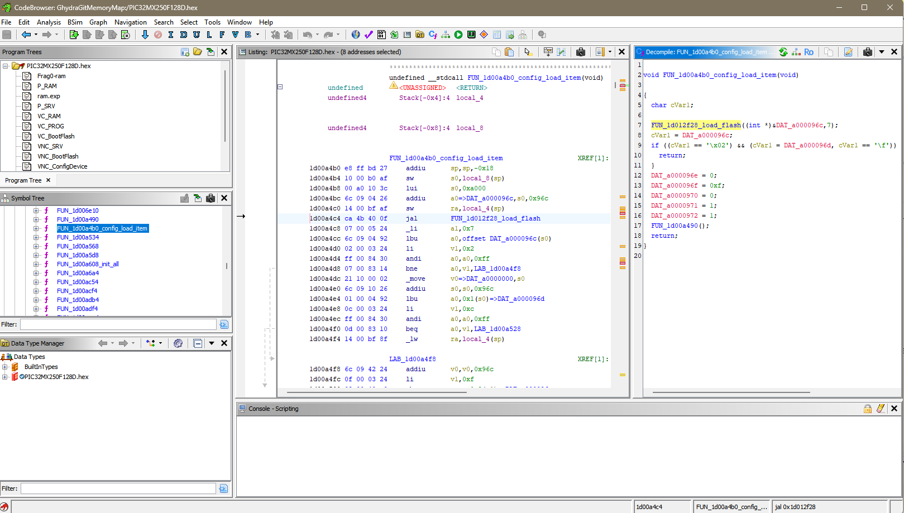

Same location in Cutter:  
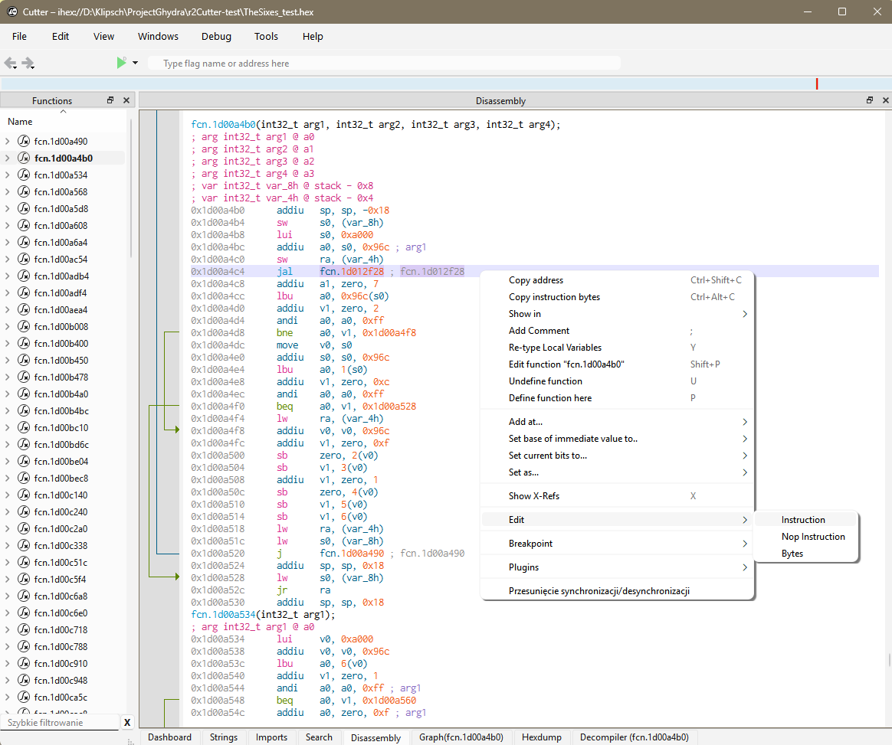

Modify instruction (sometimes requires manual byte calculation from ASM):  
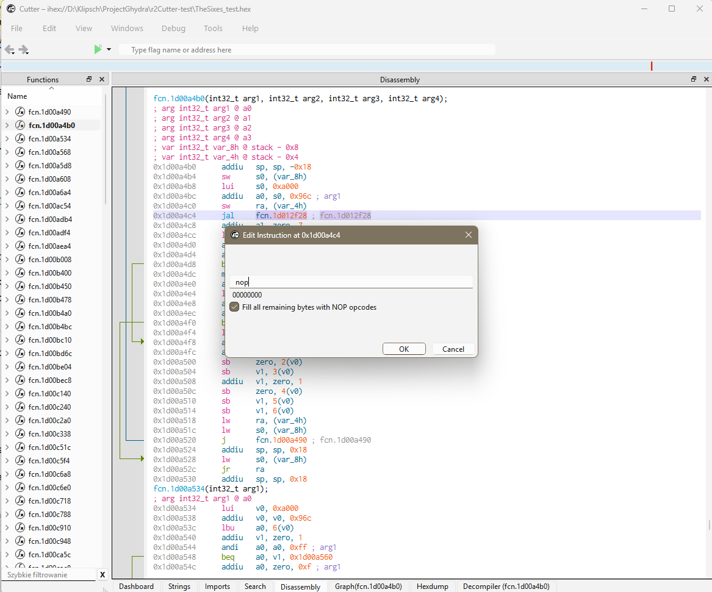

Code after applying patch:  
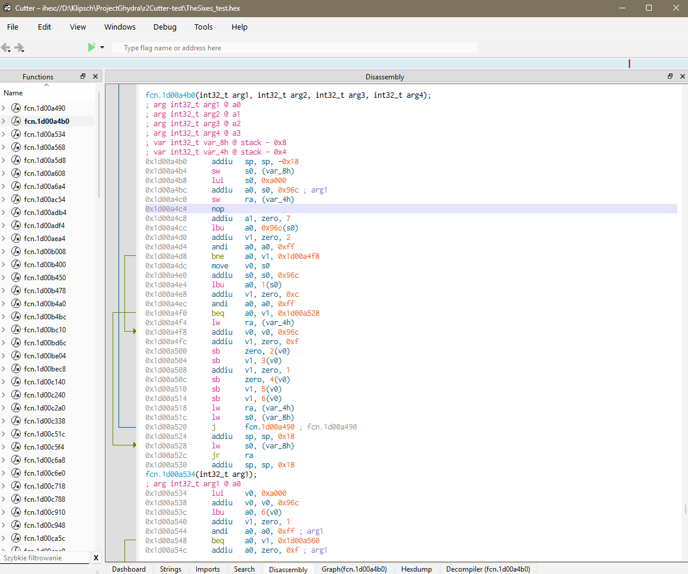

---

**Note:**  
After applying a patch, Radare2/Cutter and Ghidra do not provide a reliable undo mechanism. Always keep a backup copy before modifying the binary.

---

## Patch 1: Disable Configuration Load from Corrupted Flash

Remove loading of untrusted configuration data and keep only the default configuration path.

Changes are shown in the instructions on how to use Radare2 + Cutter.

```
ASM:
-0x1d00a4c4 ca 4b 40 0f     jal        FUN_1d012f28_load_flash                          undefined FUN_1d012f28_load_flas
+0x1d00a4c4                 nop
```
Configuration is no longer loaded from Flash during startup (only minimal validation of the first bytes remains; the rest of the configuration may still be invalid due to Flash corruption).

> ⚠️ This patch may affect Bluetooth pairing. This behavior has not been fully tested.

After boot, configuration values in RAM are initialized to default (zero).

The main MCU continues to operate correctly, including sleep mode.  
Current settings (input source, volume, etc.) are preserved only during runtime and are lost after power disconnection.

The hardware power switch triggers sleep mode only (it does not fully reset the configuration unless power is physically removed).

---

Based on code analysis, the configuration storage does not appear to implement wear leveling. This likely contributes to Flash memory degradation over time.

Since Flash configuration is no longer read, all related Flash write operations were also disabled to prevent further degradation of the Flash sector.

```
ASM:
-0x1d012f08      jal     fcn.1d013210 ; fcn.1d013210
+0x1d012f08      nop
-0x1d0130cc      jal     fcn.1d0124f4 ; fcn.1d0124f4
+0x1d0130cc      nop
```

Disable configuration header validation to always execute the initial configuration path, independent of RAM state.

Additionally, modify default configuration values, since they are used not only after a factory reset, but also after power loss.

```
ASM:
-0x1d00a4c4      nop
-0x1d00a4c8      addiu   a1, zero, 7 ; arg2
-0x1d00a4cc      lbu     a0, 0x96c(s0)
-0x1d00a4d0      addiu   v1, zero, 2
-0x1d00a4d4      andi    a0, a0, 0xff ; arg1
-0x1d00a4d8      bne     a0, v1, 0x1d00a4f8
-0x1d00a4dc      move    v0, s0
-0x1d00a4e0      addiu   s0, s0, 0x96c
-0x1d00a4e4      lbu     a0, 1(s0)
-0x1d00a4e8      addiu   v1, zero, 0xc
-0x1d00a4ec      andi    a0, a0, 0xff ; arg1
-0x1d00a4f0      beq     a0, v1, 0x1d00a528
-0x1d00a4f4      lw      ra, (var_4h)
-0x1d00a4f8      addiu   v0, v0, 0x96c
-0x1d00a4fc      addiu   v1, zero, 0xf
-0x1d00a500      sb      zero, 2(v0)
-0x1d00a504      sb      v1, 3(v0)
+0x1d00a4c4      nop
+0x1d00a4c8      nop
+0x1d00a4cc      nop
+0x1d00a4d0      nop
+0x1d00a4d4      nop
+0x1d00a4d8      nop
+0x1d00a4dc      nop
+0x1d00a4e0      nop
+0x1d00a4e4      nop
+0x1d00a4e8      nop
+0x1d00a4ec      nop
+0x1d00a4f0      move    v0, s0
+0x1d00a4f4      addiu   v0, v0, 0x96c
+0x1d00a4f8      addiu   v1, zero, 0x2  ; Default input changed from BT to USB
+0x1d00a4fc      sb      v1, 2(v0)
+0x1d00a500      addiu   v1, zero, 0xa  ; Volume changed from 15/40 to 10/40
+0x1d00a504      sb      v1, 3(v0)
```

### Input Index Mapping

- Digital: 4  
- Phono: 3  
- USB: 2  
- AUX: 1  
- BT: 0  


## Patch 2: Fix Buffer Overflow in Bluetooth Communication

The communication with the Bluetooth module uses AT commands.

The receive buffer has a fixed size of 64 bytes (confirmed by analysis, where `memset(buffer, 0, 64)` is called between commands).

The MCU waits for a line termination sequence (`\r\n`) before processing a response.
If the end-of-line sequence is not received, the parser continues writing beyond the buffer boundary into adjacent RAM regions because it never reaches a valid termination state.

***Firmware assumes that the Bluetooth module always responds correctly, even during reset conditions.***

This issue is caused by a design assumption that the Bluetooth module remains responsive throughout the entire communication cycle.  
When the module resets mid-transfer, the MCU has no recovery path for incomplete responses, which leads to uncontrolled buffer growth.

## *Bit happens!*

---

This behavior leads to **memory corruption**, which was identified as the direct cause of:
- input selector getting stuck  
- audio stopping after 20–40 minutes of operation  

---

Observed symptoms:

A repeating pattern was detected in RAM memory, which indicated the root cause of the issue.

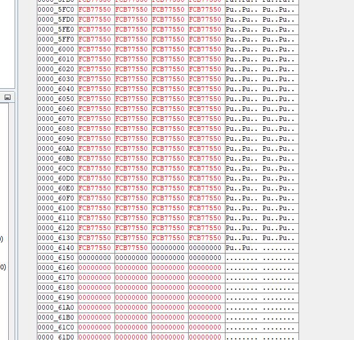

The same values also appeared in flash configuration memory, but with reversed endianness.

After setting a memory watch breakpoint, the corrupted execution path was traced to:

```c
void FUN_1d00c51c_bt_read_buffer_overflow(void)
```

This confirmed that incoming Bluetooth data was written without proper boundary checks, overwriting adjacent memory regions.
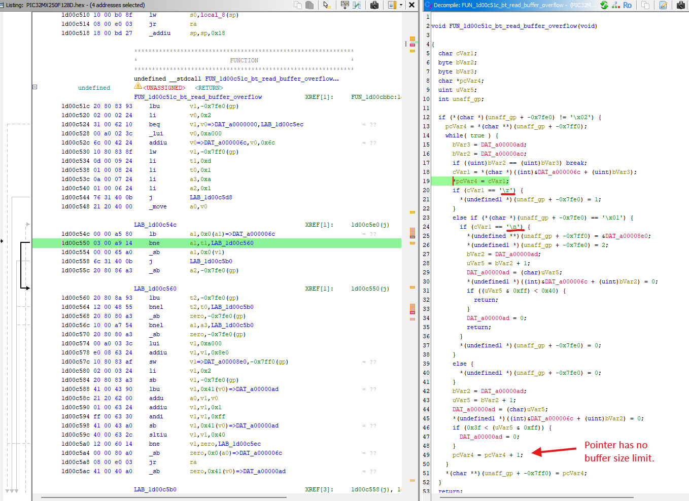

Temporary fix: prevent buffer write on overflow conditions. This disrupts BT communication but avoids memory corruption.
This fix was used only for testing; in the final solution it was reverted.
```
ASM:
//-0x1d00c554      sb      a1, 0(v1)
//+0x1d00c554      nop
```

This is the final fix that resets the buffer overflow condition. The pointer is reset to the beginning when the end of the buffer is reached.

Due to limited space in the binary, there was not enough room to patch the original assembly code. This required locating and using unused memory space within the firmware.

When the pointer reaches (buffer_start + 62), it is reset back to the beginning of the buffer.


## Real Fix

An unused region in Flash memory was used to implement the patch at address: 0x1d013500.

### Idea

Redirect execution to unused Flash space where the buffer logic is safely handled, then return to the original flow.

```
0x1d013500      nop        ; start of patch area
0x1d013504      nop
0x1d013508      nop
...
0x1d0135xx      j 0x1d00c5dc   ; return to original code flow
```

Execution flow is temporarily redirected to the patch region, where the corrected buffer handling is applied, then control is returned to 0x1d00c5dc.

Oryginal code:  
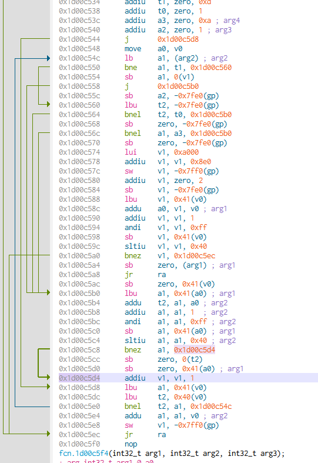

Microchip PIC32 MIPS architecture behavior has a branch delay slot. The instruction immediately after a jump is always executed before the branch takes effect. This can affect function flow, as return execution occurs after the next instruction.

Apply additional patching area. V1 address starts from 0xA00008E0. When reaching 0xA000091D (64-byte buffer, reduced to 62 bytes + null terminator handling), the pointer is reset to the beginning to prevent memory corruption.
```
ASM:
0x1d00c5c8      bnez    a1, 0x1d00c5d4
0x1d00c5cc      sb      zero, 0(t2)
0x1d00c5d0      sb      zero, 0x41(a0) ; arg1
-0x1d00c5d4      addiu   v1, v1, 1          ; Binary: 01006324
+0x1d00c5d4      j       0x1d013500         ; Binary: 404D400B
0x1d00c5d8      lbu     a1, 0x41(v0)        ; <= always execute pipeline before jump
0x1d00c5dc      lbu     t2, 0x40(v0)        ; <- back
0x1d00c5e0      bnel    t2, a1, 0x1d00c54c

; Free place in memory used on patch:
0x1d013500      addiu   v1, v1, 1			; Oryginal operation from address 0x1d00c5d4
0x1d013504      lui     t0, 0xa000          ; Byte: 00A0083C
0x1d013508      addiu   t0, t0, 0x91d
0x1d01350c      sltu    t0, v1, t0          ; Byte: 2B406800
0x1d013510      bnez    t0, 0x1d013520      ; Byte: 03000015
0x1d013514      nop
0x1d013518      lui     v1, 0xa000          ; Byte: 00A0033C
0x1d01351c      addiu   v1, v1, 0x8e0
0x1d013520      nop
0x1d013524      nop
0x1d013528      nop
0x1d01352c      nop
0x1d013530      nop
0x1d013534      nop
0x1d013538      nop
0x1d01353c      nop
0x1d013540      nop
0x1d013544      nop
0x1d013548      nop
0x1d01354c      nop
0x1d013550      j       0x1d00c5dc ; fcn.1d00c51c+0xc0
0x1d013554      nop
```
Jump to other section after preparing patch:

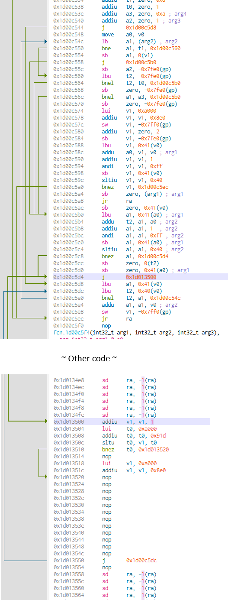

This resolved issues with the non-working input selector and audio stopping after 20-40 minutes.

It may also improve Bluetooth pairing stability, but the Bluetooth module is likely already corrupted.

---
This is the target state I wanted to achieve: stable speaker operation, potentially working correctly for years.

Because the system is now stable, further debugging and repair of the Bluetooth module was attempted.  

---

## Patch 3: Test patch change selector input

### Reversal of the original direction source control dial

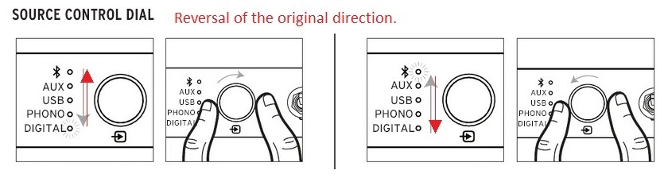

```
ASM:
-0x1d011e68      addiu   v1, zero, 9
+0x1d011e68      addiu   v1, zero, 0xa
-0x1d011e70      addiu   v0, zero, 0xa 
+0x1d011e70      addiu   v0, zero, 9 
```

This patch modifies the input behavior before proceeding with the more complex and detailed analysis of the Bluetooth module's functionality. Further steps will focus on troubleshooting and identifying the root cause of Bluetooth communication issues.

## Technical Documentation Map

### Sections:
1. **Firmware analysis** → [01_firmware_analysis.md](01_firmware_analysis.md)
2. **Patching** → This page
3. **Bluetooth hardware** → [03_bluetooth_hardware.md](03_bluetooth_hardware.md)
4. **Appendix - PICkit 3 Connection Guide** → [pickit_connection.md](pickit_connection.md)

[Back to README](../README.md)
