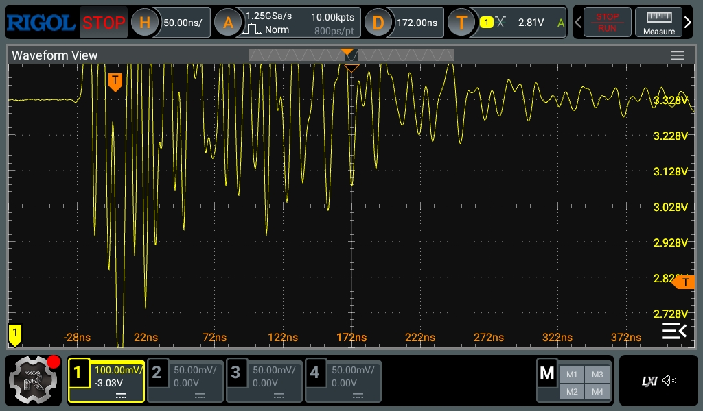
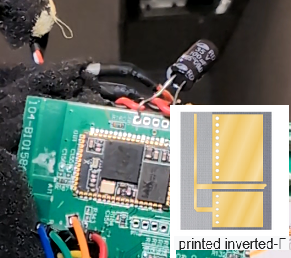

# Bluetooth hardware

## Step 5: Bluetooth hardware analysis

Bluetooth model is CSR57E6 (example PDF):  
https://www.scribd.com/document/375762333/BTA-TX-A-CSR57E6-pdf

This is a dedicated programmable chip with the ability to change sound characteristics and firmware. It has a built-in sound decoder and an audio digital-to-analog converter. I found the original chip to sound surprisingly good for such a cheap solution.

**Observed behavior:**  
The Bluetooth chip is stuck in an infinite reboot loop. This causes the "PU..." message to be repeatedly sent, possibly a power-up signal.

**Analysis / hypothesis:**  
After a lengthy code analysis, I suspect the module may be internally damaged or unstable. The chip is difficult to source, and it requires proprietary software. This makes replacing it significantly more complicated; it is unclear if the old firmware can be copied.

My prediction comes from the fact that connecting an oscilloscope to the chip's power supply rail and leaving it in single-trigger mode every few minutes can reveal a large voltage drop below 2.7V. This suggests a possible short circuit or internal instability in the chip. The BT restarts every few seconds, which is visible in the communication log, with voltage drops occurring periodically (every few minutes).
At this stage, there is no direct proof of permanent RF hardware damage.
All conclusions are based on observed behavior (reset loops and power instability), rather than confirmed internal failure of the Bluetooth SoC.

The reset behavior is also visible on the power rail.
During operation, periodic voltage drops on the 3.3V line were observed using an oscilloscope in single-trigger mode.

These drops correlate with the Bluetooth module restart cycle and occur approximately every few minutes, indicating a hardware-level instability rather than a purely software issue.

Single trigger once per few minutes, main power rail 3.3V:  

I checked the 3.3V power supply capacitors; they were OK.  
I connected additional capacitors (>500 µF) near the BT chip power rail.  
I also connected a laboratory power supply, and the voltage drops were the same in each case.

I did not detect excessive heating of the BT chip. The Bluetooth module has an inverted-F antenna (IFA) printed on the main board. The antenna appears intact based on visual inspection.

I did not find any faulty capacitors, but I do not have an infrared camera.  

### Potential reasons why the BT module can be damaged:

1. It is powered all the time when speakers are connected to power, even when the power switch is disabled. The module may not be suitable for continuous operation and may degrade over time.  
2. On the board there is a class-D power amplifier with high-power coils, possibly too close to the BT antenna.  
3. Firmware issues or buffer overflows can often reset BT modules even when they otherwise work correctly. This can degrade their lifespan.  
4. Interference on the power supply could damage the RF output stage.

### Summary

What is confirmed:
- Bluetooth module enters repeated reset cycles
- Power rail instability correlates with reset events
- System communication is disrupted during these events

What is not confirmed:
- Permanent RF transmitter failure
- Exact internal hardware damage mechanism

## Disclaimer

I hope that the material is educational and helpful in saving some equipment from being thrown away.

This is not a complete guide, and I am not responsible for any errors. Any changes you make are your own responsibility. The only way to avoid bricking the device is to prepare a full flash dump using a PICkit 3 programmer. Accessing the device is dangerous due to high voltage, and removing the adhesive from connectors is time-consuming.

## Technical Documentation Map

### Sections:
1. **Firmware analysis** → [01_firmware_analysis.md](01_firmware_analysis.md)
2. **Patching** → [02_patching.md](02_patching.md)
3. **Bluetooth hardware** → This page
4. **Appendix - PICkit 3 Connection Guide** → [pickit_connection.md](pickit_connection.md)

[Back to README](../README.md)
