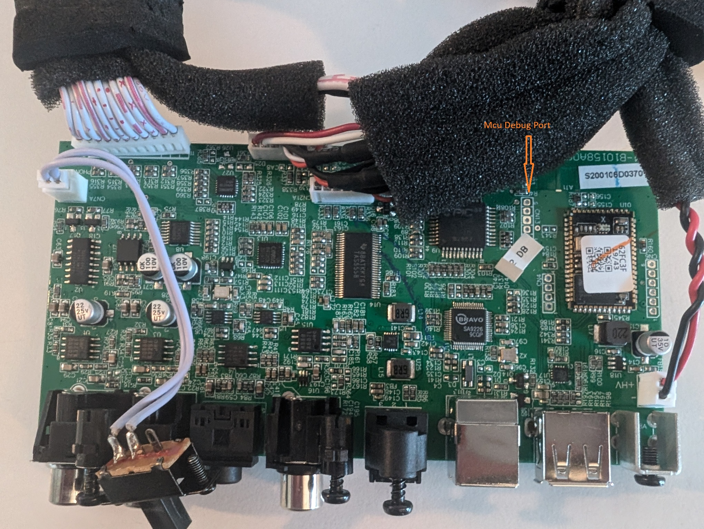
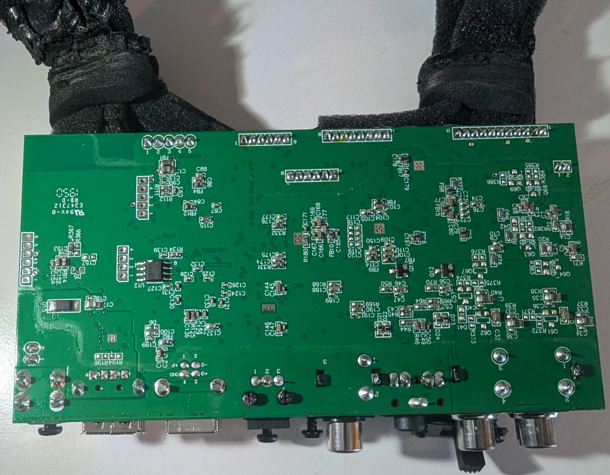
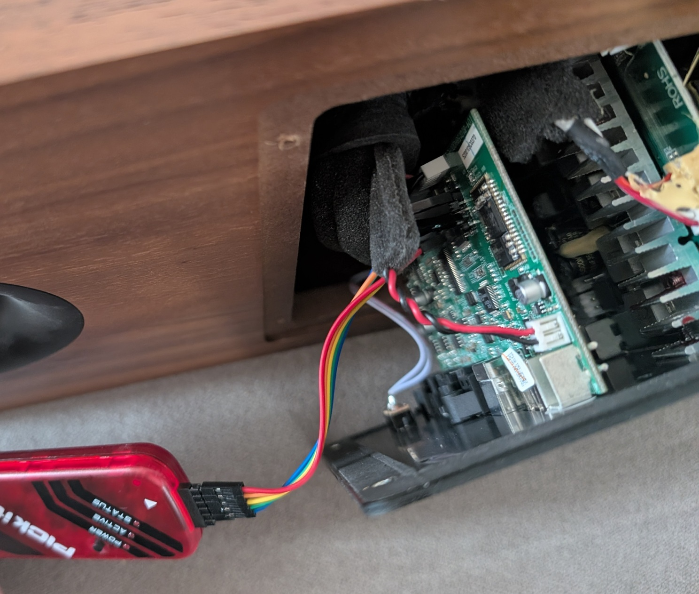
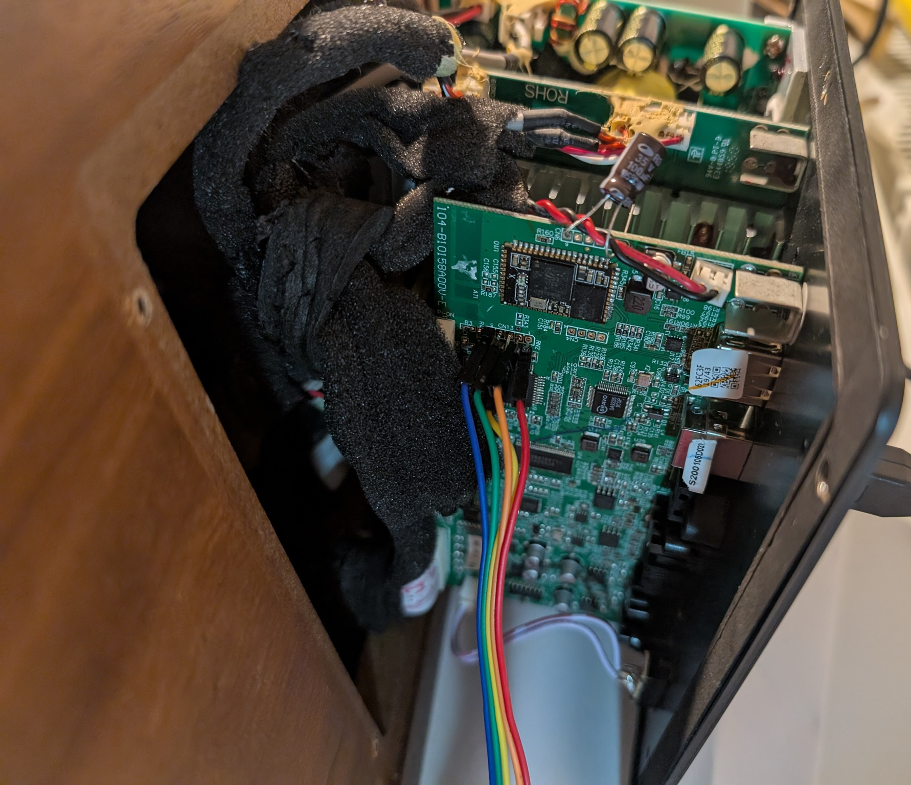
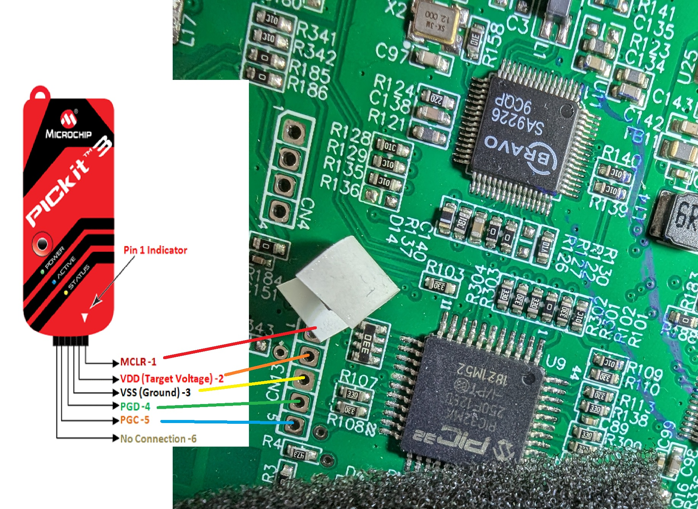
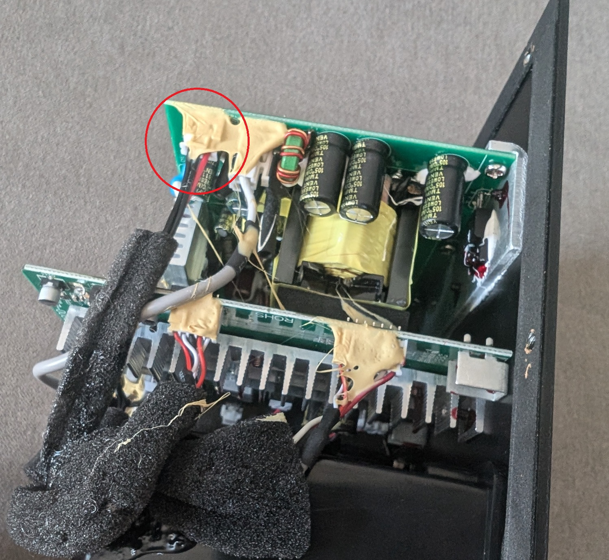
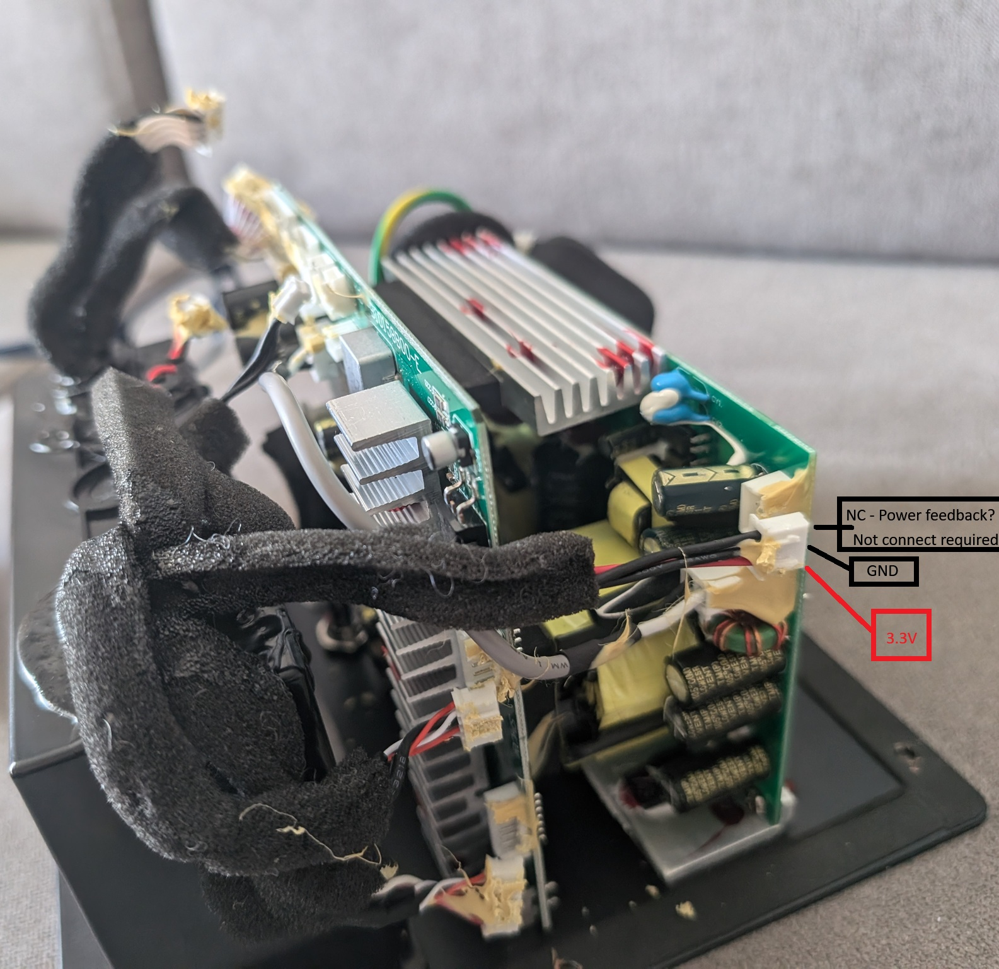

# Klipsch The Sixes – PICkit 3 Connection to Microchip PIC32MX250F128D
---

## WARNING

The high-voltage part of the power supply circuit may be exposed. Do not attempt this unless you have appropriate qualifications.

---

## Hardware Overview

  
  
  
  

---

## Power Supply (3.3V)

The MCU can be powered directly from a regulated 3.3V laboratory power supply.

Ensure that all unnecessary connections between the MCU and the amplifier board are disconnected. Only essential signal lines should remain (e.g. LED interface, input selector, IR receiver).

High voltage (230V AC) is not required for programming or debugging the MCU via the debugger.

---

  

## Technical Documentation Map

### Sections:
1. **Firmware analysis** → [01_firmware_analysis.md](01_firmware_analysis.md)
2. **Patching** → [02_patching.md](02_patching.md)
3. **Bluetooth hardware** → [03_bluetooth_hardware.md](03_bluetooth_hardware.md)
4. **Appendix - PICkit 3 Connection Guide** → This page

[Back to README](../README.md)
